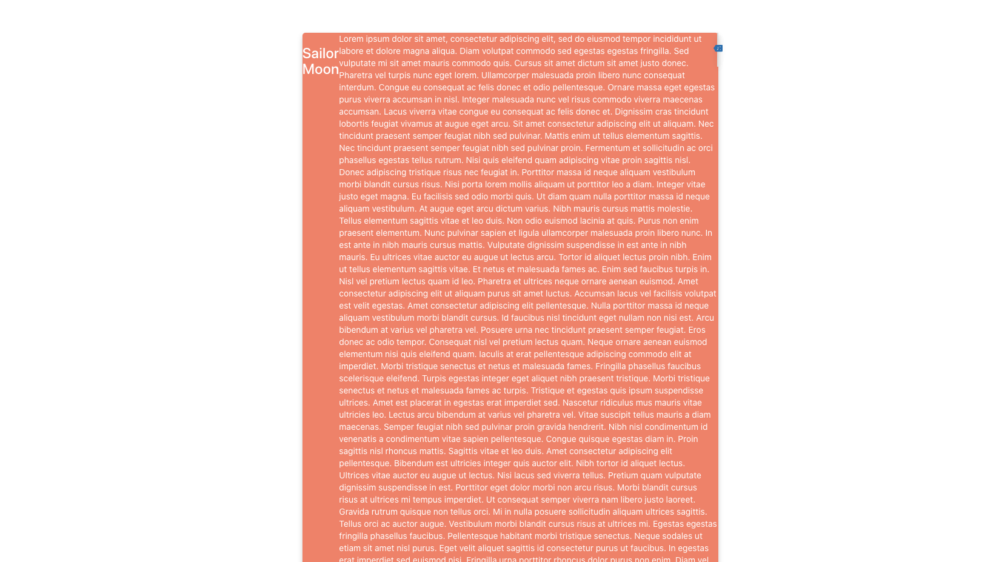

# Thoughtify

### Introduction

Thoughtify is a social media app that values the mental health well-being of its users. Users can sign up for free and share their journals/articles on an open platform, as well as interact with other users, leave supportive comments, and share in community despite physical restricitons such as quarentine, illness, or schedules. 

### Dev Team

Manuel Fuentes: Key Design Consultant
- Design/CSS
- Wireframes
- Pitch Deck

Ian Chu: Key Database Manager 
- Models
- MongoDB
- Pitch Deck

Sweet Van Loan: Key Github Master 
- Content (JSX)
- MVC
- README.md

### Wireframes

### Screenshots

### Technologies Used

- JavaScript
- HTML
- CSS
- Express
- Node.js
- MongoDB
- React

### Getting Started 

First, sign in on to [Thoughtify](https://thoughtify-by-team-c.herokuapp.com/)

From there, user will view both the "personal view" holding all the user's posts, and the "firehose view" which will hold all the public posts on the app. User will have the option to create a post, edit a post, or delete a post based on authentication. These posts are meant to be creative and shared.

### Unsolved Problems

- Redirects from various links, including edit and create
- Routing 
- Facebook share link
- functionality of buttons

### User Stories 

- AAU I would like to sign up for the App.
- AAU I would like to sign in and sign out of the App.
- AAU I would like to create a post.
- AAU I would like to edit my post.
- AAU I would like to delete my post.
- AAU I would like to view other posts.
- AAU I would like to view my own posts.

### Future Enhancements 

- Profile pic upload or avatar creator
- Confirmation of deletion
- Flexibility in view 
- Share to Facebook
- Google Authentication
- Share by full post link in social media

### React App & Other Technical Information

This project was bootstrapped with [Create React App](https://github.com/facebook/create-react-app).

## Available Scripts

In the project directory, you can run:

### `npm start`

Runs the app in the development mode. 
Open [http://localhost:3000](http://localhost:3000) to view it in the browser.

The page will reload if you make edits. 
You will also see any lint errors in the console.

### `npm test`

Launches the test runner in the interactive watch mode. 
See the section about [running tests](https://facebook.github.io/create-react-app/docs/running-tests) for more information.

### `npm run build`

Builds the app for production to the `build` folder. 
It correctly bundles React in production mode and optimizes the build for the best performance.

The build is minified and the filenames include the hashes. 
Your app is ready to be deployed!

See the section about [deployment](https://facebook.github.io/create-react-app/docs/deployment) for more information.

### `npm run eject`

**Note: this is a one-way operation. Once you `eject`, you can’t go back!**

If you aren’t satisfied with the build tool and configuration choices, you can `eject` at any time. This command will remove the single build dependency from your project.

Instead, it will copy all the configuration files and the transitive dependencies (webpack, Babel, ESLint, etc) right into your project so you have full control over them. All of the commands except `eject` will still work, but they will point to the copied scripts so you can tweak them. At this point you’re on your own.

You don’t have to ever use `eject`. The curated feature set is suitable for small and middle deployments, and you shouldn’t feel obligated to use this feature. However we understand that this tool wouldn’t be useful if you couldn’t customize it when you are ready for it.

## Learn More

You can learn more in the [Create React App documentation](https://facebook.github.io/create-react-app/docs/getting-started).

To learn React, check out the [React documentation](https://reactjs.org/).

### Code Splitting

This section has moved here: https://facebook.github.io/create-react-app/docs/code-splitting

### Analyzing the Bundle Size

This section has moved here: https://facebook.github.io/create-react-app/docs/analyzing-the-bundle-size

### Making a Progressive Web App

This section has moved here: https://facebook.github.io/create-react-app/docs/making-a-progressive-web-app

### Advanced Configuration

This section has moved here: https://facebook.github.io/create-react-app/docs/advanced-configuration

### Deployment

This section has moved here: https://facebook.github.io/create-react-app/docs/deployment

### `npm run build` fails to minify

This section has moved here: https://facebook.github.io/create-react-app/docs/troubleshooting#npm-run-build-fails-to-minify
